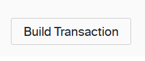
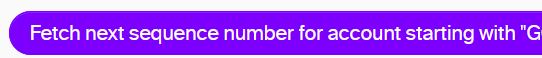
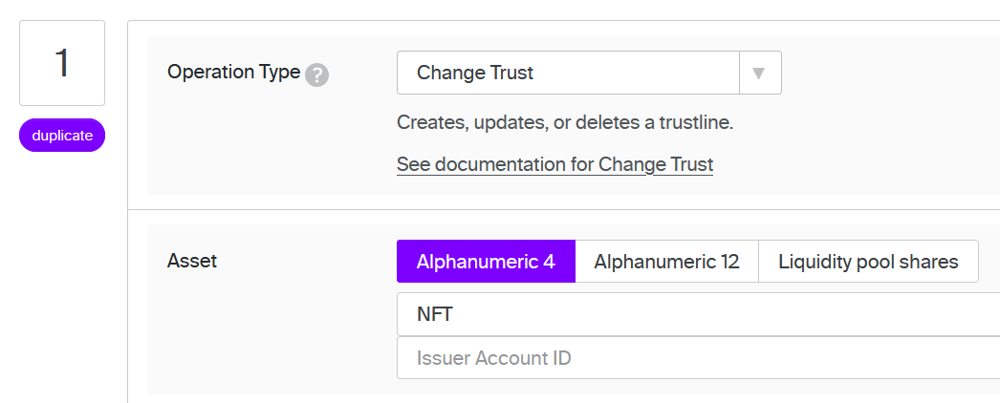
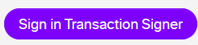
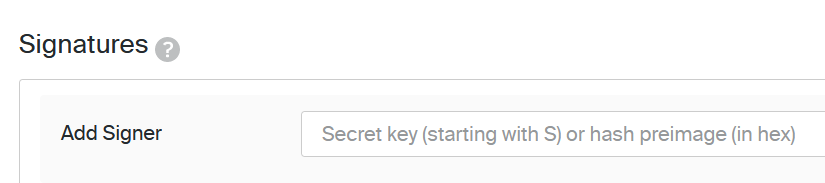
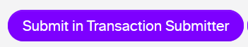

# Soroban Reverse Dutch Auction


<p align="center">
<a href="https://inquisitive-puppy-579037.netlify.app/">Live Demo</a><br/>
Soroban | Rust | Astro 
</p>

## Introduction

In a Reverse Dutch Auction, the bidding starts low, and increases over time. 
When the price reaches a level at which someone is willing to sell, the auction ends.
This type of auction works well when there are multiple suppliers and one buyer.

Soroban Reverse Auction bring this to Soroban!
To initiate a reverse auction, the buyer has to specify several pieces of information:

1) Which asset (NFT) do they want to buy?
2) Which asset are they offering to pay in?
3) What is the starting price for the auction?
4) How often will the price increase? (counted in ledgers)
5) By how much will the price increase?
6) How many times will the price increase in total?

So, for example: I want to buy an RPCiege card that is missing from my collection.
I specify that I will pay in XLM, and start bidding at 100 XLM. 
I want to increase my bid every day, so I set it to increase every (12 * 60 * 24) 17,280 ledgers.
And when it increases, I will add 20 XLM to my bid, for a total of 10 times.

This means the auction will run for 10 days, and I will pay between 100 and 300 XLM.
A potential seller can wait a few days, to get a better price. But someone else may swoop in and take the offer now!

`Note: This is a demonstration app, intended for use on testnet.`

`Using this on public net will put your funds at risk!`

The Soroban/Rust code can be viewed [here](./soroban_auction/src/lib.rs).

## Requirements

1. [Node.js](https://nodejs.org/en/)
2. [Soroban CLI](https://crates.io/crates/soroban-cli/)
3. [Rust](https://www.rust-lang.org/tools/install)
4. [Cargo](https://doc.rust-lang.org/cargo/getting-started/installation.html)
5. [Stellar Laboratory](https://laboratory.stellar.org/#?network=test)

## Deploying and running the auction on Soroban

The below steps will guide you through building, deploying and using the auction contract on Soroban Testnet.

### System setup

1. Install Rust & Wasm32 Target

```bash
curl --proto '=https' --tlsv1.2 -sSf https://sh.rustup.rs | sh
rustup target add wasm32-unknown-unknown
```

2. Install Soroban CLI

```bash
cargo install soroban-cli
```
Note: commands below assume version 20.2.0. If you have an older version, you need to run an extra command to fund each generated account.

3. Configure Soroban CLI to work with Testnet:

```bash
soroban network add --global testnet \
  --rpc-url https://soroban-testnet.stellar.org \
  --network-passphrase "Test SDF Network ; September 2015"
```
### Contract preparations

4. Create and fund two Identities on Testnet:

```bash
soroban keys generate --global buyer --network testnet
```
```bash
soroban keys generate --global seller --network testnet
```

5. Use Soroban CLI to build (compile) the contract from Rust into .wasm

```bash
cd soroban_auction
soroban contract build
```

6. Deploy the Contract to Testnet:

```bash
soroban contract deploy \
  --wasm target/wasm32-unknown-unknown/release/soroban_auction.wasm \
  --source buyer \
  --network testnet > ../.soroban/soroban_auction
```

### Asset preparation

Since our auction contract is made for buying an asset, we need to make sure that asset exists.
The buyer account also needs to have a trustline for it, to receive it at the end of the auction.
We will try to do as much as we can through Soroban, but we will need Classic Stellar at some point.

7. Make sure the native asset XLM exists as wrapped asset on Soroban

This step is very likely not needed on Testnet, but is included just in case.
```bash
soroban lab token wrap --network testnet --asset native > .soroban/native_asset
```
If someone has already wrapped the native asset, the above command will fail, and somewhere in the response you will see `data:["contract already exists"`.
No worries, then we just use:
```bash
soroban lab token id --network testnet --source-account buyer --asset native > ../.soroban/native_asset
```
to find the ID, and store that ID locally.

8. Create an 'NFT' to use in out auction

To demonstrate the auction, we'll use 1 unit (stroop) of a wrapped Stellar asset to act as NFT.
We'll need to make sure the seller holds 1 stroop of it, and that the buyer is able to receive it.
First we create, fund and store the NFT issuer address:
```bash
soroban keys generate --global NFT --network testnet
soroban keys address NFT > ../.soroban/nft_issuer
```
Then, we wrap the token, so it exists on Soroban:
```bash
soroban lab token wrap --network testnet --source NFT --asset NFT:$(cat ../.soroban/nft_issuer) > ../.soroban/nft_contract
```

9. Excursion to Classic Stellar

We need to establish the trustlines for the NFT, so that both buyer and seller can hold the NFT.
To do this, we use [Stellar Laboratory](https://laboratory.stellar.org/#?network=test)

There, we can Build a transaction:



It's possible to do the below steps in a combined transaction for both accounts. However, we're going to do them one at a time. If you know how to combine them, go ahead!

First, we set up the trustline for the seller. So, as the Source account, provide the public key of the seller account.
What it is?
```bash
soroban keys address seller
```
Make sure to click the 'Fetch next sequence number' button:


Further down, you can select an operation. Pick 'Change Trust' and click 'Alphanumeric 4'
In the 'Asset Code' box, type 'NFT':


Then, we need to fill in the issuer address. We have generated (and saved) it before.
Let's get it back so you can copy and paste it:
```bash
soroban keys address NFT
```
With that filled in, we're almost there. We can move on to Sign the transaction:

For this, we'll need the secret key of the seller account:
```bash
soroban keys show seller
```
And we can paste that into the field:

Then, all the way at the bottom, click 'Submit in transaction Submitter':


This opens a new page, where you can review the transaction, and finally submit it with another 'Submit' button.

That is the trustline for the Seller account set up. 
Now, do it again for the Buyer. You'll need the following keys, and just follow the steps above.
After that, we get back to Soroban!

```bash
soroban keys address buyer
soroban keys address NFT
soroban keys show buyer
```

10. Provide the seller with the NFT to sell.

This step can be done in two ways, through Soroban or through Classic Stellar.
We'll do it the Soroban way!

Use the below command to use Soroban CLI to invoke the NFT contract, with the NFT account,
to mint 1 stroop to the seller address.

```bash
soroban contract invoke --network testnet --source NFT \
--id $(cat ../.soroban/nft_contract) \
-- mint \
--to seller \
--amount 1
```
As a bonus, the seller can check their balance with below:
```bash
soroban contract invoke --network testnet --source seller \
--id $(cat ../.soroban/nft_contract) \
-- balance \
--id seller
```
It should return "1"

### Contract interaction

So, the NFT has been distributed, the auction contract has been deployed. We're ready to go!

11. Examine the Contract by invoking its -h from Soroban CLI:

The auction contract has 4 functions:
-setup_auction
-get_bid_info
-sell_asset
-close_auction
Don't take it from me, check it yourself:
```bash
soroban contract invoke --network testnet --source buyer \
--id $(cat ../.soroban/soroban_auction) \
-- -h
```

12. Let's finally set up that auction!:

We're going to set an auction for the NFT we just set-up, and we're going to pay in XLM.
Keep in mind that the amounts are in stroops, so the starting bid of 1000 is 0.0001000 XLM. That's not going to attract many sellers, but it keeps it nice and simple for this demo.
Every 10 Ledgers (~50 seconds), the price will increase by 100 stroops, for a total of 10 times (and a max price of 2000 stroops).

```bash
soroban contract invoke \
--id $(cat ../.soroban/soroban_auction) \
--source buyer \
--network testnet \
-- setup_auction \
--host buyer \
--auction_asset $(cat ../.soroban/nft_contract) \
--counter_asset $(cat ../.soroban/native_asset) \
--starting_bid 1000 \
--bid_incr_amount 100 \
--bid_incr_times 1000 \
--bid_incr_interval 10
```
The contract will return the Status "AuctionStarted" if all went well.
We can check the auction's balance, it should hold 2000 stroops of XLM now:
```bash
soroban contract invoke --network testnet --source buyer \
--id $(cat ../.soroban/native_asset) \
-- balance \
--id $(cat ../.soroban/soroban_auction)
```


13. Let's check the price/bid info:

Anybody interested in selling can query the current price with this command:
```bash
soroban contract invoke \
--id $(cat ../.soroban/soroban_auction) \
--source buyer \
--network testnet \
-- get_bid_info
```
It will return the information as:
`{"current_bid":"1300","current_ledger":11639,"ledgers_to_next_increase":4,"max_bid":"2000","max_bid_ledger":11703,"next_bid":"1400","next_bid_ledger":11643}`
In that, they can see what the current bid is (1300), when it will increase (in 4 ledgers), and what the next bid will be (1400).

If they want to save fees, they can also monitor the contract's events.
As soon as the contract was setup, an event was emitted with the information of how the bid will increase. Sellers can use that to calculate the price off-chain.

Wanna try that out? Try:
```bash
soroban events --network testnet \
--id $(cat ../.soroban/soroban_auction) \
--start-ledger 11500 \
--output pretty \
--type contract
```
It will also emit the current bid information any time someone invokes get_bid_info

14. The price is right!

The seller has decided that now is the time, they will sell their hard-earned NFT.
They invoke the sell_asset function, and provide their address.

```bash
soroban contract invoke \
--id $(cat ../.soroban/soroban_auction) \
--source seller \
--network testnet \
-- sell_asset \
--seller seller
```
They receive the Status AuctionFulfilled as return.
With: 
```bash
soroban contract invoke --network testnet --source seller \
--id $(cat ../.soroban/nft_contract) \
-- balance \
--id seller
```
We can see their NFT balance is now 0.
Where did it go? 
It went to the auction contract:
```bash
soroban contract invoke --network testnet --source seller \
--id $(cat ../.soroban/nft_contract) \
-- balance \
--id $(cat ../.soroban/soroban_auction)
```

15. Retrieving the NFT

🎵The auction is over and left in that room🎵
~~🎵Is that worn down piano, still a bit out of tune🎵~~
Is a shiny new NFT! 

Now, the buyer needs to close the auction in order to retrieve the NFT.
And if there was any leftover XLM, he'll want that back too.

There is one convenient function in the auction contract for that:
```bash
soroban contract invoke --network testnet --source buyer \
--id $(cat ../.soroban/soroban_auction) \
-- close_auction
```
This does a few things.
If the auction is still running (nobody has sold the asset), it will close/abort the auction, and return the XLM (of other counter_asset) to the buyer.
If the auction is fulfilled (somebody has sold their asset to the auction), this function transfers that asset to the buyer, along with any remaining counter_asset.
Only at this point does the buyer need his trustline to the asset. So if you haven't set that up, you'll get a "TransferError" return.


## Making the DApp front-end


For making the interactive frontend demo, I have relied heavily on [this tutorial](https://soroban.stellar.org/docs/getting-started/create-an-app) in the Soroban docs.
It's a very good guide, so give it a try!

I will not include or copy the basics from there, we'll fly throught the basic steps.
This repository has the setup already done, so you can clone it and go from there.

If you want to start from scratch, follow these steps:


First, we start the Astro project (make sure you are in the workspace root):
```bash
npm create astro@4.0.1 soroban-reverse-auction -- --template basics --install --no-git --typescript strictest
```
Move and remove some folders:
```bash
mv soroban-reverse-auction/* .
mv soroban-reverse-auction/.vscode .
cat soroban-reverse-auction/.gitignore >> .gitignore
rm soroban-reverse-auction/.gitignore
rmdir soroban-reverse-auction
```
Generate the bindings for our contract:
```bash
soroban contract bindings typescript \
  --network testnet \
  --contract-id $(cat .soroban/soroban_auction) \
  --output-dir node_modules/soroban_auction_client
```
Add a line to frontend/package.json under scripts:
 ```bash
"postinstall": "soroban contract bindings typescript --network testnet --contract-id $(cat ../.soroban/soroban_auction) --output-dir node_modules/soroban_auction_client" --overwrite
```

Install the node package for Freigher:
 ```bash
npm install @stellar/freighter-api
```
Run the postinstall script to re-generate the bindings (they get removed sometimes when npm installs a new package)
 ```bash
npm run postinstall
```

Now start the server, it will (ask you to) open a webpage:

```bash
npm run dev
```
Now, you have your own demo of the auction running!
In this case, it will work with the auction contract you deployed to Testnet. 

To interact with it, you will need to install Freigher extension in the browser, and import the buyer and seller account.
You'll need their secrets:
```bash
soroban keys show buyer
soroban keys show seller
```

Now, if you followed the CLI walkthrough, the buyer will have the asset, and the seller will not.
In that case, you'll have to connect the Buyer account in Freighter, and click the 'Reset the auction' button.
This will clear the auction and let you try use it again.

To set up an auction via the web-app, you'll need to supply the same information as before.
The fields are pre-filled, but beware that the NFT contract will not be the same as yours.
So, replace the value in that field with

```bash
cat .soroban/nft_contract
```

You can change the price fields, and the label below will show the maximum price.
Make sure to connect the account that does NOT currently have the 1 NFT.
When the details are to your liking, press the 'Start Auction' button.

To query the price information, click the 'Get Bid Info' button.

To make the sale, you'll have to switch to the account that holds the NFT.

Then, switch back to the other account and you can Close the auction.
For testing and demo purposes, you can also Reset the auction (after first closing it), so you can use it again.
